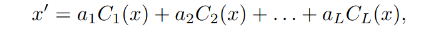
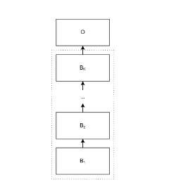

# BlockNet10 - CNN for CIFAR-10 dataset

## Overview

BlockNet10 is a neural network architecture designed for image classification tasks using the CIFAR-10 dataset. This model implements a sequence of intermediate blocks (B1, B2, ..., BK) followed by an output block (O).

## Architecture Details

### Intermediate Block (Bi)

Each intermediate block receives an input image x and outputs an image x'. The block comprises L independent convolutional layers, denoted as C1, C2, ..., CL.

Each convolutional layer Cl in a block operates on the input image x and outputs an image Cl(x).

<div style="display: flex; justify-content: center;">
  
</div>

The output image x' is computed as x' = a1C1(x) + a2C2(x) + ... + aLCL(x), where a = [a1, a2, ..., aL]T is a vector computed by the block.

The vector a is obtained by computing the average value of each channel of x and passing it through a fully connected layer with the same number of units as convolutional layers in the block.

<div style="display: flex; justify-content: center;">
  
</div>

### Output Block (O)

The output block processes the final output image from the intermediate blocks for classification.

## Analytics

<div style="display: flex; justify-content: center; align-items: center;">
  <table>
    <tr>
      <th>Epoch Number</th>
      <th>Train Accuracy</th>
      <th>Test Accuracy</th>
      <th>Average Loss</th>
    </tr>
    <tr>
      <td>50</td>
      <td>75.43</td>
      <td>80.56</td>
      <td>0.685</td>
    </tr>
  </table>
</div>

## Clone on GitHub

You can contribute to the advancement of this architecture, changes in hyperparameter, or solve issues <a href="https://github.com/siddheshtv/cifar10" target="_blank">here</a>.

## Citation

If you use BlockNet10 in your research or work, please cite it as follows:

```bibtex
@article{blocknet10,
  title={BlockNet10: CIFAR-10 Image Classifier},
  author={Siddhesh Kulthe},
  year={2024},
  publisher={Hugging Face},
  url={https://huggingface.co/siddheshtv/BlockNet10}
}
```

---

## license: mit
